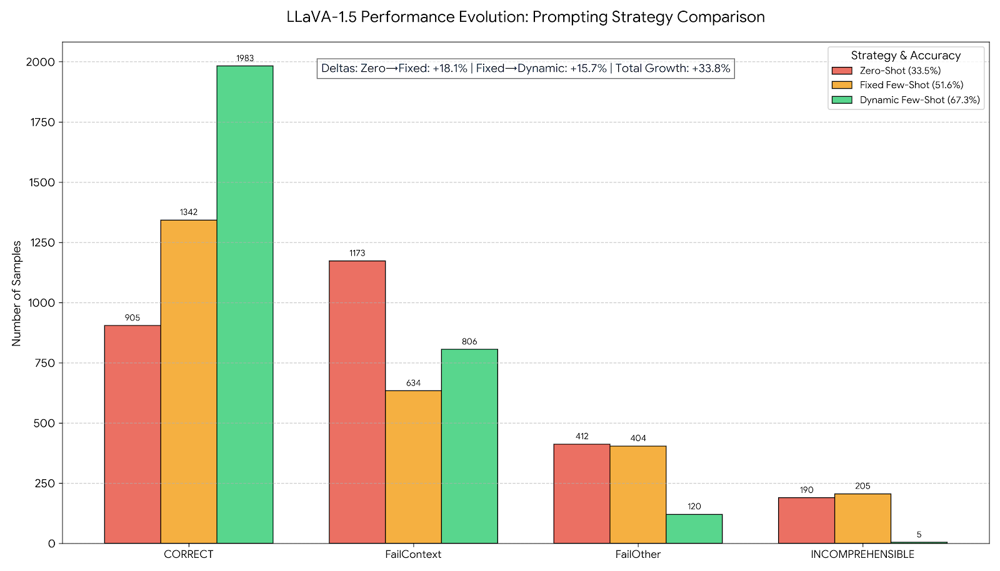
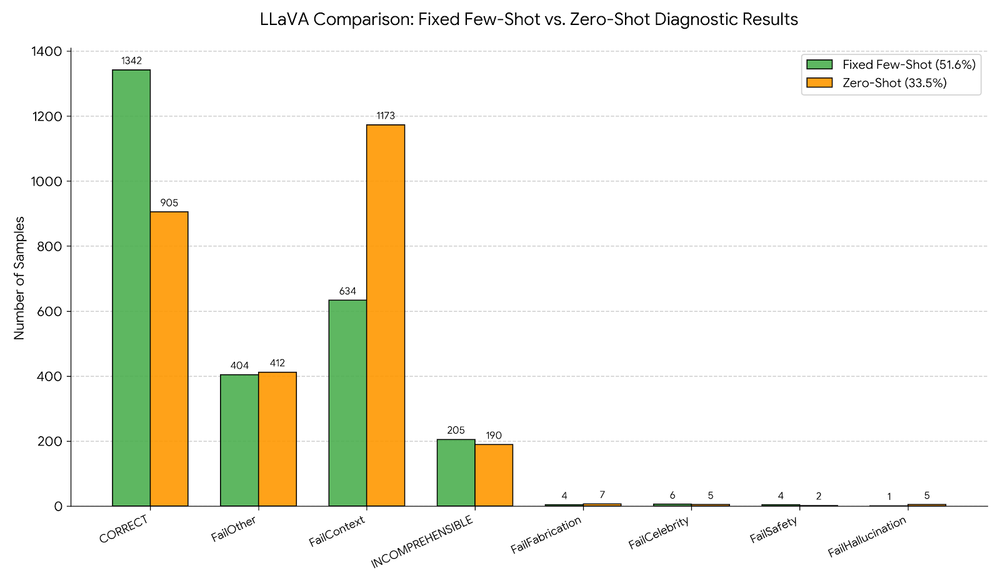
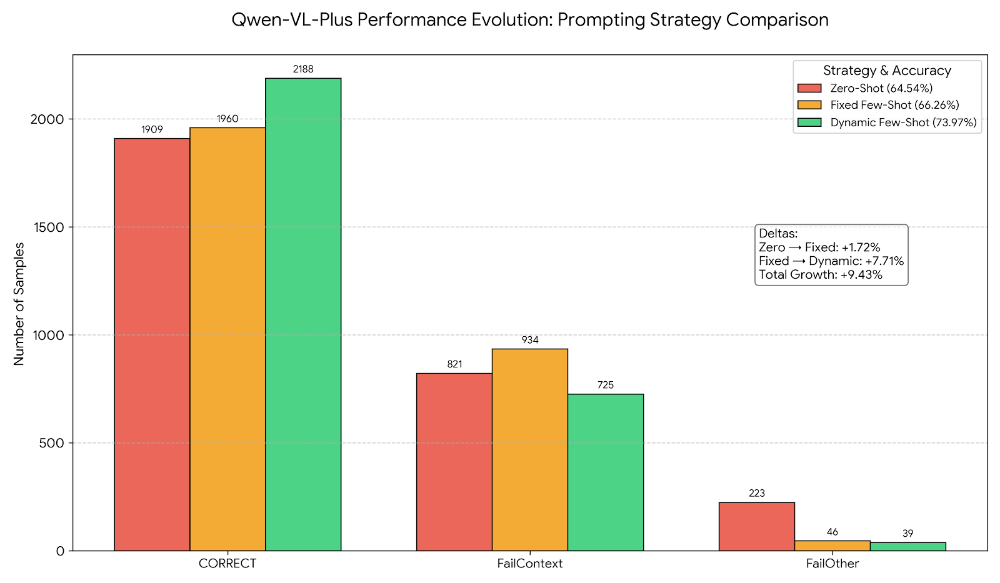
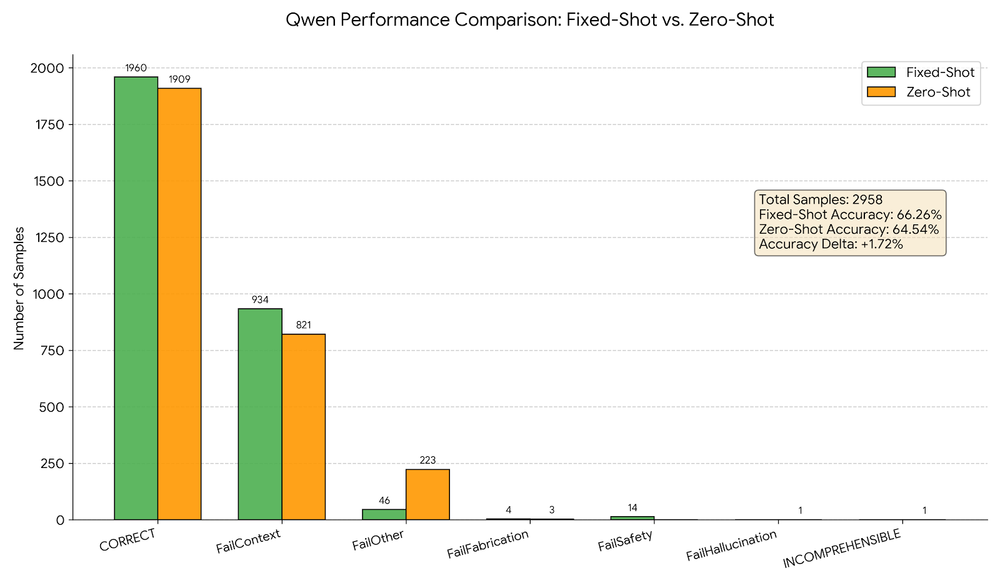

# ThumbnailTruth: Benchmarking VLMs for Misleading YouTube Thumbnail Detection

A cross-national benchmark evaluating Vision-Language Models (VLMs) on their ability to detect misleading YouTube thumbnails across 8 countries, using three prompting strategies: zero-shot, fixed few-shot, and dynamic few-shot retrieval.

> **Paper:** *Separating Clicks from Baits: Using Large Language Models to Detect Misleading YouTube Thumbnails*

---

## Overview

YouTube thumbnails are often designed to maximize clicks through exaggeration, false promises, or misleading imagery — commonly referred to as "clickbait." This project evaluates how well state-of-the-art VLMs can detect such thumbnails by cross-referencing the thumbnail image with the video's actual content (subtitles and a video-to-text description).

We benchmark **6 models** (4 proprietary, 2 open-source) across **3 prompting strategies** on a dataset of **2,843 YouTube videos** (1,359 MTV videos collectively amassing over **7.6 billion views**) spanning **8 countries**. Claude 3.5 Sonnet with dynamic few-shot prompting achieves **93.8% accuracy**, surpassing CHECKER — the leading supervised multimodal pipeline — on all metrics, without any task-specific training.

---

## Dataset

| Split | Count |
|-------|-------|
| Misleading Thumbnail Videos (MTV) | 1,359 |
| Non-Misleading Thumbnail Videos (NMTV) | 1,484 |
| **Total** | **2,843** |

**Countries covered (4 developing + 4 developed):**

| Developing | Developed |
|-----------|----------|
| Brazil | USA |
| Pakistan | UK |
| Indonesia | Spain |
| Mexico | Italy |

Countries were selected from the 20 largest YouTube audiences and classified by real-GDP growth (UN World Economic Situation and Prospects 2024).

**Annotation:** Two trained graduate annotators labeled videos using a detailed codebook. Only videos with full inter-annotator agreement were retained. **Cohen's Kappa = 0.9633** (near-perfect agreement). Minor exaggeration without thematic misrepresentation was labeled non-misleading.

Each video entry consists of:
- A thumbnail image (`{video_id}.jpg`)
- Auto-generated subtitles, translated to English via Google Translate
- A video-to-text description generated from sampled video frames

Ground truth labels (MTV / NMTV) are stored in [`dataset/mtv.csv`](dataset/mtv.csv) and [`dataset/nmtv.csv`](dataset/nmtv.csv). The full annotation codebook is in [`codebook.pdf`](codebook.pdf).

Example misleading thumbnails:
- [`Misleading-Thumbails/`](Misleading-Thumbails/) — Global samples
- [`Misleading-Thumbails-Developed/`](Misleading-Thumbails-Developed/) — From developed regions
- [`Misleading-Thumbails-Developing/`](Misleading-Thumbails-Developing/) — From developing regions

---

## Models

### Proprietary VLMs
| Model | Version | API | Videos Processed |
|-------|---------|-----|:----------------:|
| **Claude 3.5 Sonnet** | `claude-3-5-sonnet@20240620` |
| **Gemini 1.5 Flash** | `gemini-1.5-flash-001` |
| **GPT-4o-mini** | `gpt-4o-mini-2024-07-18` |
| **GPT-4o** | `gpt-4o-2024-05-13` |


### Open-Source VLMs
| Model |
|-------|
| **LLaVA-1.5** |
| **Qwen-VL** |

---

## Prompting Strategies

### Zero-Shot
The model receives the task description, thumbnail image, video subtitles, and video description — with no examples.

### Fixed Few-Shot
Two hand-crafted examples are prepended to the prompt: one misleading and one not misleading (general domain examples not drawn from the dataset).

### Dynamic Few-Shot
For each test video, semantically similar examples are retrieved from the training pool using **Sentence-BERT** (`paraphrase-MiniLM-L6-v2`). The top-100 most similar videos are ranked by cosine similarity, and 1 MTV + 1 NMTV example is selected. Each example includes:
- Thumbnail description (generated by Claude)
- Video subtitles (truncated to 200 words)
- Video-to-text description (truncated to 200 words)
- Categorization (Misleading / Not Misleading)
- One-sentence explanation (generated by Claude via [`scripts/explanation.py`](scripts/explanation.py))

> **Bias mitigation:** For dynamic prompting, video descriptions used in the retrieval pool were generated via the **12Labs API** (not Claude) to avoid over-reliance on Claude's own outputs as context.

---

## Results

### Proprietary Models

Metrics are reported from the paper (*Separating Clicks from Baits*, WebConf 2026). The best accuracy per model is listed in the summary; full metrics for Claude are shown in the ablation table below.

| Model | Best Accuracy | Avg. Accuracy | Best Strategy |
|-------|:-------------:|:-------------:|---------------|
| **Claude 3.5 Sonnet** | **93.8%** | 91.5% | Dynamic Few-Shot |
| GPT-4o-mini | 84.8% | 82.2% | Dynamic Few-Shot |
| Gemini 1.5 Flash | 82.8% | 74.8% | Zero-Shot |
| GPT-4o | 78.6% | 77.3% | Zero-Shot |

**Key metrics at best configuration** (from paper):

| Model | Accuracy | Precision | Recall | Specificity |
|-------|:--------:|:---------:|:------:|:-----------:|
| Claude 3.5 Sonnet (Dynamic) | **93.8%** | ≥ 92% | ≥ 94% | ≥ 93% |
| Gemini 1.5 Flash (Zero-Shot) | 82.8% | — | **97.8%** | 71.5% |

> Gemini excels in recall (catches almost all MTVs) at the cost of specificity (many false positives). Claude achieves the best balance across all four metrics.

**Comparison with CHECKER** (supervised SOTA): Claude (Dynamic, F1 = 0.7227) surpasses CHECKER's best (Block pooling, F1 = 0.7153), VisualBERT (0.6722), LXMERT (0.6640), and UNITER (0.6554), without any task-specific training.

---

### Open-Source Models

Metrics computed from the OpenAI Evals JSONL logs using GPT-4o-mini as chain-of-thought judge. Each incorrect prediction is tagged with a failure category: `FailContext`, `FailFabrication`, `FailHallucination`, `FailCelebrity`, `FailSafety`, or `FailOther`.

#### LLaVA-1.5

| Prompt Strategy | Accuracy | Precision | Recall | Specificity |
|-----------------|:--------:|:---------:|:------:|:-----------:|
| Zero-Shot | 36.1% | 38.7% | 67.2% | 9.6% |
| Fixed Few-Shot | 56.0% | 51.1% | 44.3% | 65.6% |
| Dynamic Few-Shot | **67.4%** | **65.0%** | **76.5%** | **58.3%** |

> Zero-shot LLaVA almost always predicts "Misleading" (recall 67%, specificity only 10%), indicating a strong positive bias. Few-shot examples substantially rebalance this behaviour.

#### Qwen-VL

| Prompt Strategy | Accuracy | Precision | Recall | Specificity |
|-----------------|:--------:|:---------:|:------:|:-----------:|
| Zero-Shot | 64.6% | 64.6% | 64.8% | 64.3% |
| Fixed Few-Shot | 66.3% | 66.3% | 66.6% | 66.0% |
| Dynamic Few-Shot | **74.0%** | **74.0%** | **74.2%** | **73.8%** |

> Qwen-VL maintains a near-balanced confusion matrix across all strategies (precision ≈ recall ≈ specificity), suggesting it does not exhibit a systematic labeling bias.

#### All Models — Accuracy Across Prompts

| Model | Zero-Shot | Fixed Few-Shot | Dynamic Few-Shot |
|-------|:---------:|:--------------:|:----------------:|
| Claude 3.5 Sonnet | 89.2%* | 91.4%* | **93.8%*** |
| GPT-4o-mini | 79.5%* | 82.3%* | **84.8%*** |
| Gemini 1.5 Flash | **82.8%*** | 70.5%* | 71.0%* |
| GPT-4o | **78.6%*** | 76.6%* | 76.5%* |
| Qwen-VL | 64.6% | 66.3% | **74.0%** |
| LLaVA-1.5 | 36.1% | 56.0% | **67.4%** |

*\* Paper-reported values (direct output parsing). Open-source model values are from JSONL judge evaluation.*

Dynamic few-shot prompting consistently improves accuracy for all models. Open-source models show the largest absolute gains from zero-shot to dynamic (+31.3 pp for LLaVA-1.5, +9.4 pp for Qwen-VL).

#### LLaVA Visualizations

| Condition | Visualization |
|-----------|---------------|
| All strategies |  |
| Fixed vs. Zero-shot |  |

Per-strategy breakdowns: [`LLaVA_Zero_Shot/`](LLaVA_Zero_Shot/), [`LLaVA_Fixed_Shot/`](LLaVA_Fixed_Shot/), [`LLaVA_Dynamic_Shot/`](LLaVA_Dynamic_Shot/)

#### Qwen Visualizations

| Condition | Visualization |
|-----------|---------------|
| All strategies |  |
| Fixed vs. Zero-shot |  |

Per-strategy breakdowns: [`Qwen_Zero_Shot/`](Qwen_Zero_Shot/), [`Qwen_Fixed_Shot/`](Qwen_Fixed_Shot/), [`Qwen_Dynamic_Shot/`](Qwen_Dynamic_Shot/)

---

## Ablation Study (Claude 3.5 Sonnet — Zero-Shot Setting)

To isolate the contribution of each input modality, we ablate the zero-shot prompt. The ablation is performed on zero-shot (not few-shot) to avoid altering few-shot exemplars, which depend on both subtitles and descriptions. Metrics are from the paper (Table 3).

| Configuration | Accuracy | Precision | Recall | Specificity |
|---------------|:--------:|:---------:|:------:|:-----------:|
| Full: Thumbnail + Description + Subtitles | 89.2% | 92.4% | 84.3% | 93.6% |
| ABL-NS: Thumbnail + Description (no subtitles) | 90.8% | 90.8% | 88.6% | 92.6% |
| ABL-ND: Thumbnail + Subtitles (no description) | 90.8% | 90.2% | 89.9% | 91.6% |
| ABL-NDS: Thumbnail only | 87.8% | 93.5% | 80.1% | 94.9% |

**Key findings:**
- ABL-NS (dropping subtitles) matches or slightly exceeds full-input accuracy, showing descriptions alone often provide sufficient context.
- ABL-NDS (thumbnail only) achieves the highest specificity (94.9%) and precision (93.5%) due to a conservative bias — but recall drops 4 pp, and models more frequently refuse to classify sensitive content.
- Video descriptions provide stronger thematic grounding; subtitles improve detection of specific misleading claims. Both are complementary.

---

## Evaluation Framework

Evaluations use the **OpenAI Evals** framework with GPT-4o-mini as a chain-of-thought judge. Raw JSONL results are stored in [`results/`](results/). Files without a timestamp prefix contain Claude/Gemini results; files with a timestamp follow the convention:

```
{run_timestamp}_{judge_model}_{subject_model}-{strategy}-eval.v1.jsonl
```

| File | Subject | Strategy | Judge Accuracy | n |
|------|---------|----------|:--------------:|:-:|
| `*_llava-zero-shot-eval.v1.jsonl` | LLaVA-1.5 | Zero-Shot | 33.5% | 2,699 |
| `*_llava-fixed-shot-eval.v1.jsonl` | LLaVA-1.5 | Fixed Few-Shot | 51.6% | 2,600 |
| `*_llava-dynamic-eval.v1.jsonl` | LLaVA-1.5 | Dynamic Few-Shot | 67.3% | 2,946 |
| `*_qwen-zero-shot-eval.v1.jsonl` | Qwen-VL | Zero-Shot | 64.5% | 2,958 |
| `*_qwen-diagnostic-eval.v1(fixed).jsonl` | Qwen-VL | Fixed Few-Shot | 66.3% | 2,958 |
| `*_qwen-dynamic-eval.v1.jsonl` | Qwen-VL | Dynamic Few-Shot | 74.0% | 2,958 |

> Raw JSONL results for Claude and Gemini are not included in this repository.

> Judge accuracy (GPT-4o-mini as evaluator) may differ slightly from paper-reported accuracy (direct output parsing). The full per-video results and country-level breakdowns are in [`Results.jpg`](Results.jpg).

---

## Per-Category Performance (Claude 3.5 Sonnet — Dynamic Few-Shot)

Evaluated on a class-balanced subset (equal MTVs and NMTVs per category). Source: paper Table 2.

| Category | Accuracy | F1 Score |
|----------|:--------:|:--------:|
| Sports | 95.3% | 0.9535 |
| Gaming | 94.7% | 0.9500 |
| Education | 93.9% | 0.9412 |
| Entertainment | 91.1% | 0.9108 |
| Comedy | 90.9% | 0.9091 |
| Howto & Style | 90.6% | 0.9032 |
| News & Politics | 90.4% | 0.8936 |
| Film & Animation | 90.0% | 0.8889 |
| People & Blogs | 88.3% | 0.8875 |
| Science & Technology | 87.5% | 0.8667 |

---

## Repository Structure

```
thumbnail-clickbaits/
├── scripts/
│   ├── download-thumbnails.py        # Download YouTube thumbnails via yt-img API
│   ├── download-subtitles.py         # Download auto-generated subtitles
│   ├── upload-thumbnails-gcp.py      # Upload thumbnails to Google Cloud Storage
│   ├── upload-videos-gcp.py          # Upload videos to GCS (for Gemini)
│   ├── create-index-12lab.py         # Create 12Labs video index
│   ├── upload-videos-12lab.py        # Upload videos to 12Labs
│   ├── video2text-claude.py          # Frame sampling + Claude 3.5 Sonnet description
│   ├── video2text-gemini.py          # Gemini 1.5 Flash video description
│   ├── video2text-12lab.py           # 12Labs Pegasus video-to-text (unbiased for dynamic prompting)
│   ├── thumbnail-description.py      # Generate one-sentence thumbnail descriptions via Claude
│   ├── explanation.py                # Generate one-sentence categorization explanations via Claude
│   ├── dynamic.py                    # Build dynamic.csv for Sentence-BERT retrieval pool
│   ├── claude-no-shot.py             # Zero-shot classification
│   ├── claude-fixed-fewshot.py       # Fixed few-shot classification
│   ├── claude-dynamic-fewshot.py     # Dynamic few-shot + Sentence-BERT retrieval
│   ├── gemini-no-shot.py             # Zero-shot (GCS thumbnails)
│   ├── gemini-fixed-fewshot.py       # Fixed few-shot
│   ├── gemini-dynamic-fewshot.py     # Dynamic few-shot
│   ├── gpt-no-shot.py                # Zero-shot (gpt-4o-mini)
│   ├── gpt-fixed-fewshot.py          # Fixed few-shot
│   └── gpt-dynamic-fewshot.py        # Dynamic few-shot
│
├── LLaVA_Zero_Shot/                  # Per-country CSVs + eval plot
├── LLaVA_Fixed_Shot/                 # Per-country CSVs + eval plot
├── LLaVA_Dynamic_Shot/               # Per-country CSVs + eval plot
├── Qwen_Zero_Shot/                   # Per-country CSVs + eval plot
├── Qwen_Fixed_Shot/                  # Per-country CSVs + eval plot
├── Qwen_Dynamic_Shot/                # Per-country CSVs + eval plot
│
├── results/                          # JSONL eval logs (OpenAI Evals format)
│
├── dataset/
│   ├── mtv.csv                       # Misleading thumbnail video URLs
│   └── nmtv.csv                      # Non-misleading thumbnail video URLs
├── codebook.pdf                      # Annotation codebook
└── Results.jpg                       # Per-country accuracy tables
```

---

## Pipeline

### Proprietary Models (Claude / GPT)

```
1. download-thumbnails.py       → {MTV,NMTV}_Thumbnails/
2. download-subtitles.py        → {MTV,NMTV}_Subtitles/
3. video2text-claude.py         → Claude_{MTV,NMTV}_Video_To_Text/
4. claude-no-shot.py            → zero-shot results
   claude-fixed-fewshot.py      → fixed few-shot results
   [+ thumbnail-description.py + explanation.py + dynamic.py]
   claude-dynamic-fewshot.py    → dynamic few-shot results
```

### Proprietary Models (Gemini)

```
1. download-thumbnails.py       → {MTV,NMTV}_Thumbnails/
2. upload-thumbnails-gcp.py     → GCS bucket
3. download-subtitles.py        → {MTV,NMTV}_Subtitles/
4. upload-videos-gcp.py         → GCS bucket
5. video2text-gemini.py         → Gemini_{MTV,NMTV}_Video_To_Text/
6. gemini-no-shot.py            → zero-shot results
   gemini-fixed-fewshot.py      → fixed few-shot results
   gemini-dynamic-fewshot.py    → dynamic few-shot results
```

### Proprietary Models (GPT)

```
1. download-thumbnails.py       → {MTV,NMTV}_Thumbnails/
2. download-subtitles.py        → {MTV,NMTV}_Subtitles/
3. create-index-12lab.py        → 12Labs index
4. upload-videos-12lab.py       → 12Labs upload
5. video2text-12lab.py          → 12Lab_{MTV,NMTV}_Video_To_Text/
6. gpt-no-shot.py               → zero-shot results
   gpt-fixed-fewshot.py         → fixed few-shot results
   gpt-dynamic-fewshot.py       → dynamic few-shot results
```

### Dynamic Few-Shot Preprocessing (all models)

```
create-index-12lab.py + upload-videos-12lab.py + video2text-12lab.py
  → 12Lab_{MTV,NMTV}_Video_To_Text/       (unbiased video descriptions)
thumbnail-description.py
  → {MTV,NMTV}_Thumbnail_Description/     (one-sentence thumbnail descriptions)
explanation.py
  → {MTV,NMTV}_Explanations/              (one-sentence categorization justifications)
dynamic.py
  → dynamic.csv                           (Sentence-BERT retrieval pool)
```

> Using 12Labs for dynamic-prompt video descriptions minimizes potential bias from over-reliance on Claude when Claude is also the subject model being evaluated. As an alternative, you can run `dynamic.py` on the video descriptions generated by the model under testing.

---

## Configuration

All scripts require the following path/credential placeholders to be updated before running:

| Placeholder | Description |
|-------------|-------------|
| `your-project-id` | Google Cloud project ID (Claude / Gemini via Vertex AI) |
| `/path/to/your/csv/` | Path to `mtv.csv` or `nmtv.csv` |
| `<api-key>` | OpenAI API key (GPT scripts) |
| `<bucket-name>` | Google Cloud Storage bucket name (Gemini scripts) |

For MTV and NMTV runs: each script contains commented-out directory variables for the NMTV pass — uncomment those lines and comment the MTV equivalents before running on NMTV videos.

---

## Dependencies

```
anthropic / anthropic-vertex
vertexai (google-cloud-aiplatform)
openai
sentence-transformers
sklearn
pandas
opencv-python (cv2)
pytubefix
requests
```
